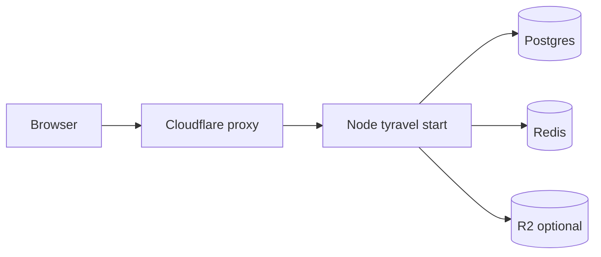

# Deploy with Cloudflare

Cloudflare fits Tyravel apps **today** as a reverse proxy, CDN, object store, and (optionally) static asset host. Running the **full framework on Cloudflare Workers** is not supported in 1.x — Tyravel requires Node.js 26+, a filesystem for compiled views, and long-lived processes for queues and WebSockets.

This guide covers what works now, recommended split architectures, and the path toward deeper edge integration.

## What works today

| Cloudflare product | Tyravel integration | Status |
|--------------------|---------------------|--------|
| **DNS + proxy** (orange cloud) | Origin on Fly/Railway/Docker | Production-ready |
| **Cache / CDN** | `ETag` middleware + cache rules | Production-ready — [edge cache cookbook](/cookbook/edge-cache) |
| **R2 object storage** | `@tyravel/storage-r2` disk driver | Production-ready |
| **WAF / DDoS / TLS** | In front of Node origin | Production-ready |
| **Cloudflare Tunnel** | Expose dev/staging origin securely | Production-ready |
| **Pages** (static) | Vite/client build artifacts | Production-ready |
| **Workers** (full Tyravel) | — | Not supported (roadmap) |
| **D1** | — | Not supported (ORM uses `node:sqlite` / TCP drivers) |
| **Queues** (CF) | — | Use Tyravel queue on origin |

## Recommended: Cloudflare in front of Node

The most reliable pattern for a full Tyravel app (SSR, sessions, queues, broadcasting):



### 1. Point DNS to your origin

1. Deploy Tyravel to [Fly.io](/guide/deployment/fly), [Railway](/guide/deployment/railway), or [Docker](/guide/deployment/docker).
2. Add your domain in Cloudflare DNS.
3. Enable **proxied** (orange cloud) A/AAAA or CNAME to the origin hostname.
4. Set SSL mode to **Full (strict)** when the origin serves HTTPS.

### 2. Set origin env vars

```bash
APP_URL=https://your-domain.example
TRUST_PROXY=true          # if your app reads X-Forwarded-* (scaffold when behind proxy)
TYRAVEL_HOST=0.0.0.0
```

Ensure session cookies use `Secure` in production (`SESSION_SECURE=true`).

### 3. Cache safe GET routes

Use Tyravel HTTP cache middleware on public, idempotent routes:

```typescript
import { createHttpCacheMiddleware } from '@tyravel/http';

Route.get('/posts/:slug', showPost, {
  middleware: [
    createHttpCacheMiddleware({ maxAge: 300 }),
  ],
});
```

In Cloudflare **Cache Rules**, cache `GET` paths that return `Cache-Control: public` or your middleware `max-age`. Do **not** cache authenticated dashboard routes.

See [Edge response cache](/cookbook/edge-cache) for Cloudflare rule examples.

### 4. WebSockets (broadcasting)

Cloudflare supports WebSocket pass-through on proxied domains. Your origin must terminate the Tyravel WebSocket hub; Redis fan-out still runs on the origin side. Configure your reverse proxy to upgrade WebSocket connections (Fly and Railway handle this by default).

## R2 for file storage

Install the driver and register the provider:

```bash
npm install @tyravel/storage-r2
```

```typescript
// config/storage.ts
export default {
  default: 'r2',
  disks: {
    r2: {
      driver: 'r2',
      bucket: env('R2_BUCKET', 'tyravel'),
      endpoint: env('R2_ENDPOINT'), // https://<account>.r2.cloudflarestorage.com
      accessKeyId: env('R2_ACCESS_KEY_ID'),
      secretAccessKey: env('R2_SECRET_ACCESS_KEY'),
      publicUrl: env('R2_PUBLIC_URL'), // optional custom domain or r2.dev
    },
  },
} satisfies StorageConfig;
```

```typescript
// src/main.ts
import { R2StorageServiceProvider } from '@tyravel/storage-r2';

app.register(R2StorageServiceProvider);
```

Files upload from your **Node origin** to R2 via the S3-compatible API. You do not need Workers for storage.

## Partial deployment patterns

### Pattern A — Static assets on Pages, API on Node

| Layer | Host | Runs |
|-------|------|------|
| `/*.js`, `/*.css`, `/build/*` | Cloudflare Pages | Vite build output |
| `/api/*`, SSR pages | Node (Fly/Railway) | Full Tyravel |

Configure Pages custom domain for static paths; proxy `/api` and dynamic HTML to the origin via Cloudflare **Origin Rules** or separate subdomain (`api.example.com`).

### Pattern B — Headless API behind Cloudflare

Best API latency story without SSR on edge:

```bash
npm create tyravel@latest my-api -- --headless
```

Deploy API to Fly/Railway; put Cloudflare in front for TLS, rate limiting, and bot protection. Use [JSON fast path](/guide/performance) defaults for stateless routes.

### Pattern C — Pre-built bundle on a small VM + Cloudflare CDN

For a single-region origin with aggressive edge caching:

```bash
tyravel config:cache && tyravel route:cache && tyravel view:cache
tyravel build --outfile=bootstrap/app.mjs --minify
```

Run `node bootstrap/app.mjs` on a Fly Machine or VPS; Cloudflare caches public HTML at the edge.

### Pattern D — Tunnel for staging

```bash
cloudflared tunnel --url http://127.0.0.1:3000
```

Useful for preview environments without opening ports. Not a replacement for production origin hosting.

## What does not work on Workers (yet)

Cloudflare Workers are not a drop-in replacement for `tyravel start`:

| Tyravel requirement | Workers limitation |
|---------------------|-------------------|
| Node.js 26+ (`node:sqlite`, etc.) | Subset Node compat; no `node:sqlite` |
| Filesystem (`view:cache`, `storage/framework`) | No persistent local disk |
| `tyravel queue:work` | No long-lived background processes |
| `tyravel start --cluster` | Isolated isolates, not `node:cluster` |
| Native WebSocket hub + Redis | Limited; custom fan-out needed |

**Hyperdrive** can accelerate Postgres from Workers, but Tyravel still needs a port of the HTTP kernel, view runtime, and boot profile to Workers — planned as a future adapter, not available in 1.x.

## Roadmap: deeper Cloudflare support

Planned increments (not yet shipped):

1. **Edge adapter** — headless JSON routes on Workers with Hyperdrive + KV session opt-in
2. **SSR at edge** — precompiled views only, no runtime `.tyr` compile on Workers
3. **Tyravel Cloud** — managed deploy with Cloudflare R2 + CDN integrated by default

Track progress in [Tyravel Cloud](/guide/deployment/tyravel-cloud) and the [GitHub ROADMAP](https://github.com/thesimonharms/tyravel/blob/main/ROADMAP.md).

## Troubleshooting

| Symptom | Fix |
|---------|-----|
| Redirect loop | SSL mode **Full (strict)**; origin must serve valid HTTPS |
| Session lost on every request | Cookie `Secure` + correct `APP_URL`; avoid caching `Set-Cookie` routes |
| WebSocket disconnects | Disable Cloudflare Rocket Loader on WS paths; confirm origin upgrade |
| Stale HTML at edge | Short `max-age` + `ETag`; use cache bypass for authenticated routes |
| R2 upload 403 | Check bucket CORS and API token permissions |

## Related

- [Platform matrix](/guide/deployment/platforms)
- [Edge response cache](/cookbook/edge-cache)
- [Storage](/guide/storage) — R2 driver
- [Headless API](/guide/headless)
- [Fly.io](/guide/deployment/fly) — common origin pairing with Cloudflare